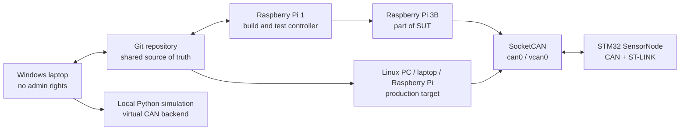
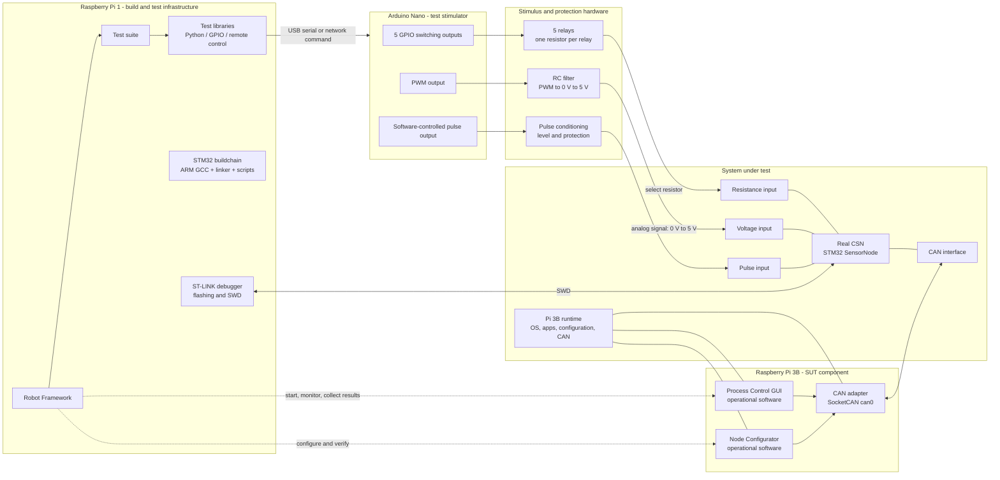
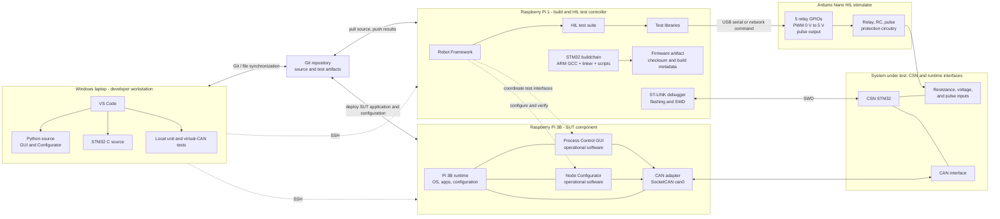
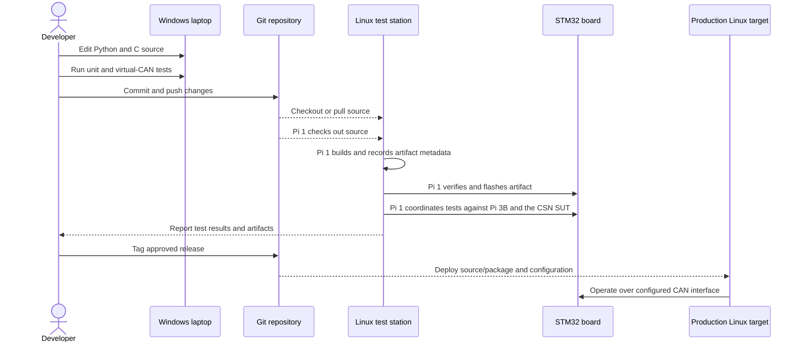

# Recommended Development Infrastructure

## 1. Purpose

This document defines the recommended infrastructure for developing and validating the Process Control software and STM32 SensorNode firmware.

The constraints are:

- Most development is performed on a Windows laptop.
- The Windows user does not have administrator rights.
- WSL cannot be used.
- The final Python product must run on Linux PCs, laptops, and Raspberry Pi systems.
- STM32 firmware must be built, flashed, and debugged against physical hardware.

The recommendation is a Windows-first development workflow with the existing Raspberry Pis split by responsibility. The Windows laptop remains the primary editing and host-test environment; Raspberry Pi 1 provides the Linux STM32 build and test-controller environment; Raspberry Pi 3B is part of the SUT and runs the operational Process Control software and CAN interface.

## 1.1 Test Terminology

For integration and system tests, **SUT** means **System Under Test**. In this project the SUT is the behavior being evaluated across the relevant system boundary: the real CSN or CSNs, their firmware and configuration, the CAN bus, the Process Control GUI or Node Configurator, and the required sensor stimuli and observation interfaces.

The CSN and Raspberry Pi 3B are therefore SUT components. The SUT boundary includes the Pi 3B operating environment, Process Control GUI, Node Configurator, CAN adapter/interface, CSN firmware and configuration, CAN bus behavior, and required sensor stimuli and observation interfaces. Raspberry Pi 1, the test software, Arduino stimulus hardware, ST-LINK, and measurement equipment are test infrastructure that drives or observes the SUT. **DUT** is reserved for a narrowly scoped component-level test where one specific device or component is intentionally isolated; it should not be used as the name of the CSN or Pi 3B in integration or system-test documentation.

## 2. Recommended Topology



### Windows laptop

Used for the majority of daily work:

- Python GUI and NodeConfigurator development
- Firmware C and header editing
- Unit tests and protocol tests
- Local simulated-CAN integration tests
- Documentation and Git operations

The Windows environment must not require system-wide installation or administrator privileges for normal development.

### Raspberry Pi 1 build and test controller

Raspberry Pi 1 is used for operations that require Linux tooling and test control:

- STM32 buildchain and firmware artifact creation
- Test orchestration and evidence storage
- ST-LINK flashing and debugging equipment
- Arduino stimulus control
- Hardware-in-the-loop tests

### Raspberry Pi 3B SUT node

Raspberry Pi 3B is part of the SUT. It runs the operational Process Control GUI, Node Configurator, Python runtime, CAN adapter, and SocketCAN interface used by the deployed system. It may be controlled by Pi 1 during automated tests, but its application behavior, runtime configuration, CAN communication, and interaction with the CSN are evaluated as part of the SUT.

### Production target

The production target may be an x86-64 Linux PC/laptop or an ARM Raspberry Pi. The Python application should use configuration to select the CAN interface and must not configure network interfaces from inside application code.

## 2.1 HIL Test Deployment

The hardware-in-the-loop (HIL) station consists of two Raspberry Pis with separated responsibilities. Raspberry Pi 1 owns the STM32 buildchain, automated test execution, ST-LINK test equipment, and result storage. Raspberry Pi 3B is part of the SUT: it runs the operational Process Control GUI and Node Configurator, hosts the CAN adapter, and communicates with the real CSN.

The Arduino Nano is the electrical test stimulator. It is controlled by the Raspberry Pi 1 and must be connected to the CSN through suitable relay contacts, level protection, filtering, current limiting, and common-ground or isolation circuitry as required by the CSN electrical design.



### Deployment responsibilities

| Component | Responsibility | Connection |
| --- | --- | --- |
| Raspberry Pi 1 | Runs the STM32 buildchain, Robot Framework, test suites, sequencing, assertions, result storage, and ST-LINK tools. | Builds firmware, controls the Arduino Nano, and flashes/debugs the CSN as test infrastructure. |
| Robot Framework | Coordinates stimulus actions and SUT interactions, then evaluates observed system behavior. | Test libraries connect to GPIO/serial control and the Pi 3B SUT interfaces. |
| Arduino Nano | Generates the electrical input conditions for the CSN. | Five GPIOs drive five relay controls; one PWM output drives the filtered voltage path; one software-controlled output drives the pulse path. |
| Relay/protection board | Selects one of five resistance values and protects the Nano and CSN interfaces. | Relay contacts connect the selected resistor to the CSN resistance input. |
| PWM/RC circuit | Converts the Nano PWM signal into an adjustable analog stimulus. | Provides an analog signal from 0 V to 5 V to the CSN voltage input. |
| Pulse conditioning circuit | Shapes and protects the Nano pulse output. | Provides the required pulse levels and timing to the CSN pulse input. |
| Raspberry Pi 3B | SUT component running the operational GUI, Configurator, Python runtime, and CAN interface. | Communicates with the CSN over the CAN bus and is controlled by Pi 1 during tests. |
| CAN adapter | SUT communication component providing the CAN interface used by GUI and Configurator. | `can0` on the Raspberry Pi 3B to the CSN CAN bus. |
| Real CSN | SUT component; executes the actual STM32 firmware and produces CAN measurements/status. | Receives resistance, voltage, and pulse stimuli plus CAN configuration/control. |

### Test-control relationship

Robot Framework should treat the Pi 3B applications as externally controlled SUT interfaces rather than directly importing their internal Python modules. The test suite should:

1. Command the Pi 1/Arduino Nano to apply a defined stimulus.
2. Use the operational GUI or Configurator interface on the Pi 3B to configure or observe the SUT.
3. Read the resulting measurement, state, error, and control values through the Pi 3B CAN path.
4. Compare the observed result with the expected value and store the test evidence on the Pi 1.

The Pi 1 and Pi 3B should use a defined network protocol or SSH-based command interface. The test suite must identify which Pi owns each operation so that test execution, SUT interaction, CAN communication, and stimulus generation do not become implicit dependencies.

### Stimulus channels

- **Resistance input:** Five Arduino GPIO outputs operate five relay channels. Each relay connects a different resistor to the CSN resistance input. The test suite should define whether relay combinations are forbidden, allowed, or interpreted as additional resistance values.
- **Voltage input:** One Arduino PWM output passes through the RC filter and protection stage to produce an analog signal from 0 V to 5 V. The test suite should allow settling time after each duty-cycle change before sampling the CSN.
- **Pulse input:** One Arduino output generates the software-controlled pulse signal. The required frequency, duty cycle, pulse count, and start/stop behavior should be specified per test case. Timing-critical pulse generation should use Arduino hardware timers where the required accuracy exceeds what a software loop can provide.

### HIL safety and startup requirements

- Default all Arduino stimulus outputs to an inactive and electrically safe state during reset and boot.
- Prevent relay changes while a measurement is being sampled unless the test explicitly requires a transition.
- Confirm the selected resistor and voltage output before connecting stimulus to the CSN.
- Keep the CSN actor outputs disabled or connected to safe loads during sensor-input tests.
- Record stimulus values, relay states, PWM duty cycle, pulse parameters, CAN frames, firmware state, and error code with each test result.
- Keep HIL configuration separate from production configuration on both Raspberry Pis.

## 2.2 Development and HIL Deployment Diagram

This deployment view combines the Windows development environment with the HIL installation. The Windows laptop is the primary development workstation. SSH is used to operate Raspberry Pi 1 test infrastructure and the Raspberry Pi 3B SUT without requiring the Windows laptop to have CAN or STM32 USB drivers.

Raspberry Pi 1 hosts the ARM STM32 buildchain, Robot Framework test controller, and ST-LINK test equipment. Raspberry Pi 3B is part of the SUT and hosts the operational Linux Python applications and CAN adapter. The Pi 3B receives its application source/configuration and the CSN firmware artifact through the defined deployment workflow; it must not compile source code.



### Deployment node responsibilities

| Deployment node | Deployed components | Main responsibility |
| --- | --- | --- |
| Windows laptop | VS Code, Python source, STM32 source, local tests | Daily implementation, review, documentation, and fast software-only validation without administrator rights. |
| Raspberry Pi 1 | ARM GCC toolchain, build scripts, Robot Framework, HIL tests, test libraries, ST-LINK tools | Firmware compilation, artifact metadata/checksums, test sequencing, assertions, result storage, Arduino Nano control, and CSN flashing/debugging. It does not host the SUT application or access its runtime CAN interface. |
| Raspberry Pi 3B | SUT operating system, GUI, Configurator, Python runtime, `python-can`, SocketCAN, and CAN adapter | Operational SUT behavior, physical CAN communication, application/configuration behavior, and interaction with the CSN. It does not compile source code or host test-control tools. |
| Arduino Nano | Relay GPIO control, PWM generator, pulse generator | Electrical stimulation of the real CSN through the protection and conditioning circuits. |
| Real CSN | STM32 firmware, CAN, sensor inputs | SUT component. Receives HIL stimuli, executes firmware, and reports measurements/status over CAN. |

### Connections

- **Windows to Pi 1:** SSH for starting builds and Robot Framework, retrieving test results, and maintenance.
- **Windows to Pi 3B:** SSH for deploying the SUT application/configuration and retrieving SUT observations. Flashing and debugging are performed from Pi 1 test infrastructure.
- **Repository to both Pis:** Git-based source and test synchronization. Pi 1 publishes traceable firmware artifacts; generated logs and artifacts should be identified and retained separately from source files.
- **Pi 1 to CSN:** Pi 1 verifies and flashes the selected firmware artifact using ST-LINK. The firmware artifact remains associated with the test evidence and source revision.
- **Pi 1 to Arduino Nano:** USB serial is preferred for explicit stimulus commands; a network command service may be used if the Nano is physically remote from Pi 1.
- **Pi 1 to Pi 3B:** Test-library calls over the network or SSH control the SUT applications and retrieve observations.
- **Pi 3B to CSN:** The SUT CAN adapter exposes `can0` through SocketCAN for the GUI and Configurator.
- **Pi 1 to CSN debugger:** ST-LINK uses SWD for flashing and source-level debugging. SWD is test infrastructure and is separate from the SUT CAN communication path.
- **Arduino Nano to CSN:** The relay, RC, and pulse-conditioning circuits provide the resistance, 0 V to 5 V analog, and pulse stimuli. The Nano must not be connected directly to unprotected CSN inputs.

## 3. Windows Python Development

### 3.1 User-level installation

Use a Python installation available to the user, either an existing corporate installation or a user-local installation. Create the environment inside the repository:

```text
ProcessControl/
  .venv/
  GUI/
  NodeConfigurator/
  SensorNode/
```

Create and activate it from PowerShell or Command Prompt:

```text
py -m venv .venv
.venv\\Scripts\\activate
python -m pip install --upgrade pip
python -m pip install -r requirements-dev.txt
```

If the Python launcher is unavailable, use the approved user-level Python executable in its place. Dependency installation must stay inside `.venv` and must not use a system-wide package directory.

### 3.2 Local CAN simulation

Windows development should use a simulated CAN backend rather than Linux-specific SocketCAN commands. `python-can` provides a virtual bus suitable for protocol and application tests.

Recommended backend selection:

```text
CAN_BACKEND=virtual     Windows development and automated tests
CAN_BACKEND=socketcan   Linux hardware or vcan tests
CAN_INTERFACE=can0      Physical Linux CAN interface
CAN_INTERFACE=vcan0     Linux virtual CAN interface
```

The application should expose one CAN interface abstraction. The GUI and Configurator should depend on that abstraction, not directly on `os.system`, `sudo`, `ip`, `ifconfig`, or a concrete `can.interface.Bus` constructor.

A simulated SensorNode should implement the relevant protocol behavior:

- Runtime data frames
- Setup request on `0x7F0`
- Configuration frames `0x7F1` through `0x7F4`
- Setup termination and persistent configuration behavior
- Runtime set-value handling
- State transitions needed by the tests

This permits most Python development without a CAN adapter or physical STM32 board.

### 3.3 Windows responsibilities and limitations

Supported locally without administrator rights:

- GUI layout and behavior
- Configurator workflows
- XML/configuration parsing
- CAN frame encoding and decoding through the virtual backend
- Logging and file output
- Firmware-independent logic tests
- Firmware source editing and review

Normally dependent on administrator-installed drivers or a managed station:

- Physical USB-CAN communication
- ST-LINK USB access
- Hardware-in-the-loop testing
- Direct SocketCAN testing

## 4. Linux and Raspberry Pi Infrastructure

Use Debian, Ubuntu, or Raspberry Pi OS. Raspberry Pi 1 should have the build and test-controller tools:

- Python 3 and `venv`
- `python-can`
- `can-utils`
- ARM GNU toolchain for STM32
- A supported STM32 flashing/debugging tool
- Git
- Optional CMake or Make
- Optional pytest and coverage tools

Raspberry Pi 3B should have only the SUT runtime tools:

- Python runtime and application dependencies
- `python-can` and `can-utils`
- CAN adapter and SocketCAN configuration
- Artifact verification tools

The ARM buildchain, firmware compiler, and ST-LINK tools must not be installed on Pi 3B.

The physical CAN interface should be configured outside the Python application. A typical Linux setup is conceptually:

```text
CAN bitrate: 500000
Physical interface: can0
Virtual test interface: vcan0
```

The exact interface setup requires administrator privileges on the Linux station and should be performed by the station owner or administrator. The application should only open the already-configured interface.

### Raspberry Pi considerations

For a Raspberry Pi deployment:

- Prefer a supported CAN HAT or USB-CAN adapter.
- Use a reliable power supply.
- Use a read-only or industrial-grade storage strategy where possible.
- Run the application as a dedicated non-root user.
- Store logs outside the source tree.
- Configure automatic startup with a `systemd` service prepared by the administrator.
- Keep development, production, and hardware-test configuration files separate.

## 5. STM32 Development Workflow

STM32 development is split into source work on Windows and hardware operations on the Linux test station.

### 5.1 Source development on Windows

The Windows laptop is suitable for:

- Editing `SensorNode/Firmware/Inc/` and `SensorNode/Firmware/Src/`
- Reviewing HAL and application boundaries
- Implementing state, configuration, CAN, scheduling, and sensor logic
- Writing host-side tests for portable logic
- Reviewing compiler output produced by the Linux station
- Git commits and documentation

The firmware source does not need to execute on Windows.

### 5.2 Build on Raspberry Pi 1

Raspberry Pi 1 should provide an ARM embedded toolchain, normally `arm-none-eabi-gcc`, together with the project linker script, startup code, STM32 HAL sources, and build configuration. Pi 1 builds the exact committed revision and publishes an artifact; Pi 3B must not compile source code.

The build should produce at least:

```text
SensorNode firmware artifacts:
  .elf  debugging symbols and debugger input
  .hex  programming/distribution format
  .bin  optional raw binary
```

The build must be scripted so the same command can be run manually, remotely, and later by CI. The existing System Workbench project can be used initially if it remains the only known-good build, but a command-line build should be introduced as soon as practical.

The artifact should include the source revision, compiler version, build options, and checksum. Conceptual workflow:

```text
Windows edit -> Git push/commit -> Pi 1 checkout -> build -> artifact and checksum -> Pi 3B
```

### 5.3 Flash and debug from Raspberry Pi 1

Connect the STM32 board and ST-LINK programmer to Raspberry Pi 1. Pi 1 receives the traceable build artifact, verifies it, and owns:

- ST-LINK USB access and drivers
- Firmware flashing
- Reset and device identification
- Breakpoint debugging
- Firmware log or diagnostic capture
- CAN hardware connection
- Sensor and actor verification

The Windows laptop can control both Pis through SSH or remote desktop. Pi 3B remains the runtime SUT; Pi 1 provides the physical programming and debugging connection used by test infrastructure.

### 5.4 Firmware test layers

Use progressively more hardware-specific tests:

1. **Host-side unit tests:** state transitions, calibration arithmetic, CAN packing/unpacking, configuration validation.
2. **Cross-build checks:** compile the firmware with the ARM toolchain and treat warnings as review items.
3. **Protocol simulation:** connect the Windows Python tools to the simulated SensorNode.
4. **Hardware-in-the-loop:** connect the Linux test station, real CAN bus, STM32 node, and sensors/actors.
5. **Release smoke test:** flash the release artifact and verify startup, setup, runtime frames, and error handling.

## 6. Repository and Configuration Structure

The infrastructure should evolve toward the following structure:

```text
ProcessControl/
  .venv/                         local Windows environment, ignored by Git
  requirements.txt               runtime Python dependencies
  requirements-dev.txt           test and development dependencies
  pyproject.toml                 Python tooling configuration
  tests/
    python/
    protocol/
    simulated_node/
  tools/
    run_virtual_can_tests.py
    build_firmware.sh
    flash_firmware.sh
  config/
    development-windows.toml
    test-virtual-can.toml
    production-linux.toml
    production-raspberry-pi.toml
  GUI/
  NodeConfigurator/
  SensorNode/
  Architecture/
```

The current source tree may not contain all of these files yet. They describe the intended infrastructure boundary, not a claim that the files already exist.

Configuration should define at least:

- CAN backend
- CAN interface name
- CAN bitrate where applicable
- GUI update period
- Logging directory
- Firmware artifact path for test scripts
- Target node ID

Secrets, machine-local paths, and generated logs must not be committed.

## 7. Development and Release Flow



## 8. Responsibilities by Environment

| Activity | Windows laptop | Linux test station | Production Linux/Pi |
| --- | --- | --- | --- |
| Edit Python | Primary | Optional | No |
| Edit STM32 C | Primary | Optional | No |
| Python unit tests | Primary | Yes | Smoke tests |
| Virtual CAN tests | Primary | Yes | Optional |
| SocketCAN tests | No | Primary | Yes |
| Physical CAN | Only if drivers already exist | Primary | Yes |
| STM32 compilation | No | Pi 1 primary | Usually no |
| STM32 flashing/debugging | Usually no | Pi 1 primary | No |
| GUI validation | Primary | Yes | Yes |
| Release packaging | Optional | Primary | No |
| Field operation | No | Optional | Primary |

## 9. Required Architectural Changes

The current code contains Linux-specific setup and direct CAN construction in the Python applications. Before this infrastructure can be used reliably, make these changes:

1. Introduce a small CAN transport interface used by both GUI and Configurator.
2. Select `virtual` or `socketcan` through configuration or command-line arguments.
3. Move bitrate and interface setup into Linux deployment scripts.
4. Remove `sudo`, `ip`, and `ifconfig` calls from application startup.
5. Add a simulated SensorNode for Windows protocol tests.
6. Add protocol tests for setup frames, runtime frames, signed values, and byte order.
7. Add a scripted firmware build on Pi 1.
8. Transfer immutable firmware artifacts with build metadata and checksums from Pi 1 to Pi 3B.
9. Keep flashing and debugging as explicit Pi 1 test-infrastructure operations; treat Pi 3B as part of the SUT.
10. Add separate development, build, test, and production configuration files.
11. Document the exact Pi 1 build/ST-LINK service and Pi 3B SUT runtime/CAN setup for the station administrator.

These changes preserve the existing CAN integration boundary while making the application portable across Windows development, Linux desktop deployment, and Raspberry Pi deployment.

## 10. Infrastructure Decision

Adopt **Windows-first development with separated existing Raspberry Pi roles**:

- Raspberry Pi 1 is the build and HIL test-controller station.
- Raspberry Pi 3B is part of the SUT and runs the operational GUI/Configurator and physical CAN runtime.
- Raspberry Pi 1 is the build and test-infrastructure station for Robot Framework, ST-LINK flashing, and debugging.
- The CSN and its runtime interfaces form the SUT for integration and system tests.

This is the best fit for the constraints because it keeps the bulk of development local and administrator-independent, while reserving Linux for the capabilities that cannot be reproduced faithfully on the Windows laptop: SocketCAN, physical CAN, STM32 flashing, and hardware debugging.

The Pi 1 build station should produce traceable artifacts rather than sharing a live source/build environment with the SUT. Pi 3B should receive the required application and firmware artifacts as part of SUT deployment and must not compile source code. The virtual CAN backend and simulated SensorNode provide the fast feedback loop; hardware-in-the-loop testing provides final SUT confidence.
