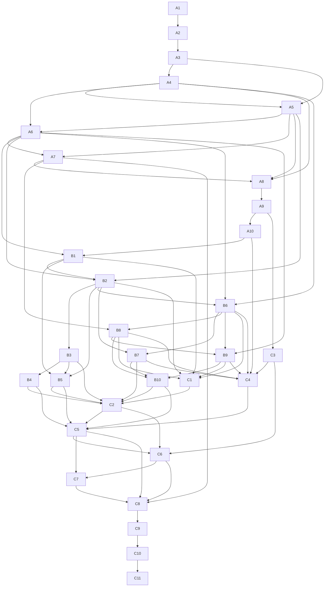
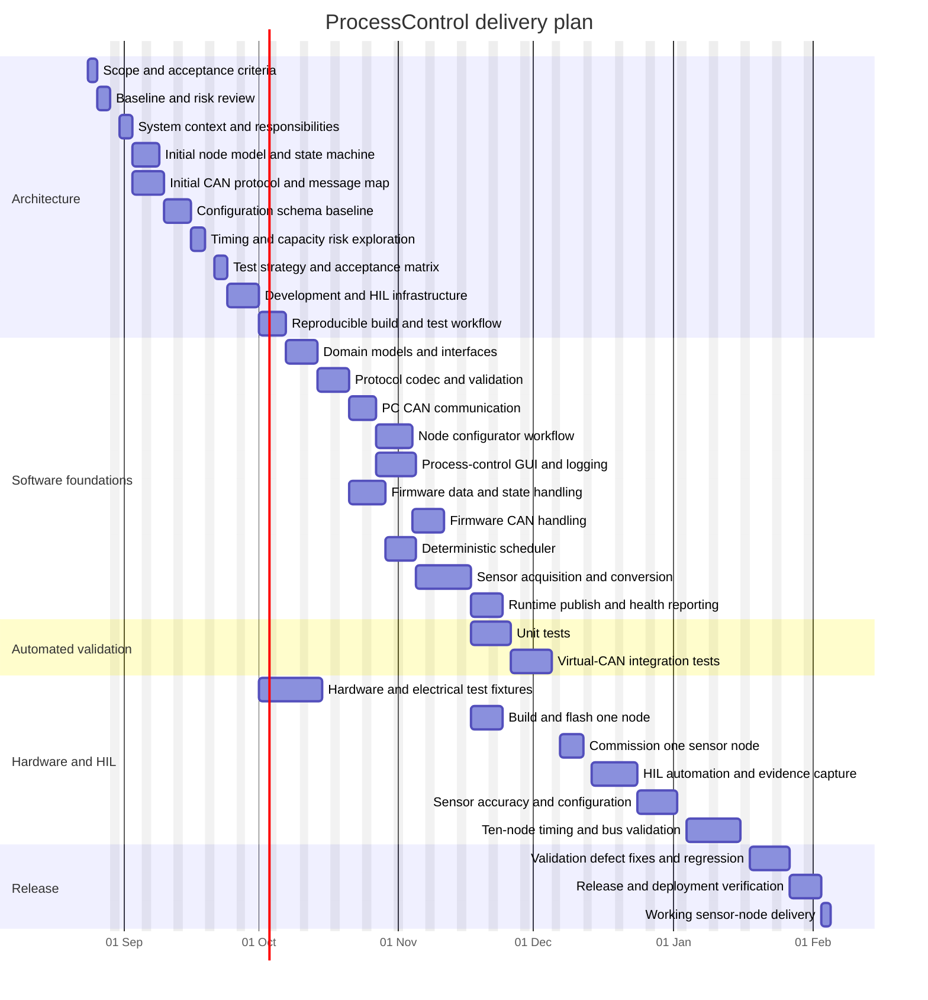

# ProcessControl Task Plan

## Purpose

This document turns the existing architecture, refactoring plan, and hardware-in-the-loop concept into an adaptive, dependency-aware delivery plan. It starts with enough architecture to begin safely and evolves the backlog through short, test-first increments until verified working sensor nodes operate on a CAN bus.

Task IDs are stable references used by the dependency table and Gantt chart.

## Planning Assumptions

- The first release target is configurable sensor nodes and central monitoring/logging.
- Actor behavior remains compatible with the shared node firmware but is not a prerequisite for the first sensor-node milestone.
- Software-only work is performed on Windows; Linux hardware-in-the-loop work is performed on the Linux test station.
- The 10 ms measurement/publish period for at least 10 sensors is a release requirement.
- Hardware design and procurement must be completed far enough ahead of flashing and HIL testing.
- Not all requirements are known at project start. New information is captured as backlog items and prioritized against value, risk, learning, and dependencies.
- The task list is a product backlog and initial roadmap, not a promise that every task will be completed in the listed order or duration.
- Each increment delivers a usable vertical slice where possible: a small behavior, its test, implementation, and demonstrable evidence.

## Agile And Test-First Workflow

Work in short sprints of one to two weeks. Begin with a prioritized backlog refinement session and finish with a demonstration and retrospective. Architecture, requirements, and estimates are revisited after each sprint based on what was learned.

For each backlog item, use this loop:

1. **Discover:** clarify the user or system outcome, assumptions, risks, and acceptance examples.
2. **Specify:** write the smallest failing automated test or executable acceptance example.
3. **Implement:** make the smallest change that makes the test pass.
4. **Refactor:** improve design and remove duplication while keeping the tests green.
5. **Demonstrate:** show the behavior and record test, timing, hardware, or measurement evidence.
6. **Learn:** update the backlog, architecture decisions, dependencies, and priority.

### Definition Of Ready

A backlog item is ready for a sprint when its outcome is understood, acceptance examples are identified, dependencies and risks are visible, the test level is selected, and the item is small enough to finish within the sprint.

### Definition Of Done

An item is done when the implementation and focused tests pass, relevant regression tests pass, documentation and protocol evidence are updated, review findings are resolved, and the result can be demonstrated. Hardware items additionally require safe setup, captured measurements, and a reproducible reset/recovery procedure.

### Agile Planning Tasks

These recurring tasks govern the roadmap and are performed throughout the project:

- **Backlog refinement:** split discoveries into small items, clarify acceptance examples, estimate effort, and update dependencies.
- **Sprint planning:** select the highest-value ready items while reserving capacity for defects, integration, and discovery.
- **Sprint review:** demonstrate the increment on the virtual CAN simulator or real CSN, as appropriate, and capture evidence.
- **Retrospective:** identify process or technical improvements and add them to the backlog.
- **Architecture decision review:** update the living architecture when tests, hardware measurements, or new requirements invalidate an assumption.

## Task List And Dependencies

| ID | Task | Deliverable | Depends on |
| --- | --- | --- | --- |
| A1 | Establish initial product goal and release criteria | Initial sensor-node-first goal, 10 ms timing target, and acceptance criteria to validate and refine | - |
| A2 | Document current baseline and risks | Baseline architecture, known defects, hardware assumptions, and open questions | A1 |
| A3 | Define system context and responsibilities | Component boundaries for GUI, configurator, controller, CAN bus, firmware, and test stations | A2 |
| A4 | Create initial node model and state machine | Initial node roles, configuration lifecycle, states, events, and error behavior; revise as evidence arrives | A3 |
| A5 | Create initial CAN protocol and message map | Initial IDs, payload layouts, byte order, signedness, timing, acknowledgements, and versioning rules | A3, A4 |
| A6 | Define and evolve configuration schema | Versioned node ID, type, units, limits, update rate, calibration, and status fields | A4, A5 |
| A7 | Explore timing and capacity risks | Initial 10-sensor traffic budget, slot/offset strategy, CPU budget, jitter target, and deadline policy | A5, A6 |
| A8 | Define living test strategy and acceptance matrix | Test pyramid, behavior examples, unit, integration, system, HIL, timing, and release evidence requirements | A4, A5, A7 |
| A9 | Define development and HIL infrastructure | Toolchain, virtual CAN approach, separated Pi 1 build/test-controller and Pi 3B SUT roles, ST-LINK, Arduino, and result storage | A8 |
| A10 | Establish reproducible build and artifact workflow | Dependency files, host-test commands, STM32 build scripts, artifact metadata/checksums, flashing commands, formatting/linting, and CI or repeatable local checks | A9 |
| B1 | Isolate shared domain models and interfaces | Models and interfaces for configuration, runtime state, measurement, logging, clock, and bus access | A6, A10 |
| B2 | Implement protocol codec and validation | Shared CAN encoding/decoding, range checks, version checks, acknowledgement, and timeout handling | A5, A6, B1 |
| B3 | Refactor PC CAN communication | One owned bus adapter, safe receive handling, correct payloads, and test doubles | B2 |
| B4 | Refactor node configurator workflow | Non-blocking setup/read/write/verify flow using the canonical model and protocol codec | B2, B3 |
| B5 | Refactor process-control GUI and logging | Presentation-only GUI, separated orchestration, synchronized runtime data, and non-blocking logging | B1, B2, B3 |
| B6 | Refactor firmware data and state handling | Explicit constants/runtime ownership, validated transitions, and reliable flash persistence | A4, A6, B2 |
| B7 | Refactor firmware CAN handling | One receive path, protocol-compatible setup/runtime handling, and diagnostics | B2, B6 |
| B8 | Implement deterministic scheduler | Fixed 10 ms cycle, configurable phase offset, deadline tracking, and bounded work | A7, B6 |
| B9 | Implement sensor acquisition and conversion | ADC, pulse, filtering, calibration, scaling, and sensor error behavior behind a common interface | A6, B6, B8 |
| B10 | Implement runtime publish and health reporting | Correct measurement/status frames, freshness tracking, missed-deadline reporting, and recovery behavior | B7, B8, B9 |
| C1 | Add unit tests | Coverage for schema, validation, codecs, conversion, scheduler, state, timeout, and logging logic | B1, B2, B6, B8, B9 |
| C2 | Add virtual-CAN integration tests | End-to-end PC codec, configurator, controller, and simulated-node message flows | B3, B4, B5, B7, B10, C1 |
| C3 | Build hardware and electrical test fixtures | CSN hardware, CAN wiring, safe loads, Arduino stimulator, relay/protection, and pulse/voltage conditioning | A9 |
| C4 | Build and flash firmware on one node | Pi 1 produces and verifies a traceable firmware artifact, then flashes/debugs the CSN; Pi 3B runs the deployed SUT software | B6, B7, B8, B9, C3, A10 |
| C5 | Commission one sensor node | Configure one real node, verify CAN communication, measurement, persistence, and restart behavior | B4, B5, B10, C2, C4 |
| C6 | Add HIL automation and evidence capture | Robot Framework or equivalent sequencing, stimulus control, CAN observation, logs, and result artifacts | C2, C3, C5 |
| C7 | Validate sensor accuracy and configuration workflow | Verify resistance, voltage, and pulse measurements against external references; verify setup and control behavior | C5, C6 |
| C8 | Validate 10-node timing and bus capacity | Ten nodes at 10 ms publish rate, bus load, jitter, latency, loss, and deadline evidence | A7, C5, C6, C7 |
| C9 | Fix defects found by validation and rerun regression | Resolved timing, protocol, firmware, GUI, and hardware issues with preserved evidence | C8 |
| C10 | Release and deployment verification | Linux packaging, production configuration, operating procedure, rollback, and final test report | C9 |
| C11 | Deliver working sensor nodes | At least 10 configured sensor nodes operate together, publish measurements every 10 ms, and pass acceptance criteria | C10 |

## Dependency Graph

## Proposed Agile Delivery Order

1. **Initial discovery and architecture baseline:** A1-A8. Define only the current understanding, identify uncertainty, and turn assumptions into testable backlog items.
2. **Enable the feedback loop:** A9-A10. Establish the virtual CAN simulator, separate Pi 1 build/test-controller and Pi 3B SUT roles, reproducible test commands, artifact verification, and evidence storage.
3. **First vertical slice:** Select the smallest valuable behavior from B1-B10 or B6-B10, write its test first, implement it, and demonstrate it in a sprint review.
4. **Expand by risk and value:** Prioritize protocol, configuration, scheduler, sensor conversion, GUI, and firmware slices based on the latest evidence rather than subsystem order.
5. **Keep integration continuous:** Run C1-C2 after every relevant increment; do not defer virtual CAN integration until all software modules are complete.
6. **Introduce physical validation deliberately:** Use C3-C7 when the backlog contains hardware-dependent behavior, while keeping simulator-backed tests for fast regression.
7. **Scale and harden:** Use C8-C10 to validate sensor accuracy, HIL behavior, and ten-node timing; each defect becomes a prioritized regression item and every tested firmware version remains traceable to its build artifact.
8. **Release incrementally:** Complete C11 only when the current release backlog, deployment checks, and acceptance evidence meet the agreed release criteria; otherwise replan the next sprint.

The dependency column describes technical prerequisites, not a mandatory waterfall sequence. Within a sprint, independent items may run in parallel. At each review, add, remove, split, merge, or reprioritize tasks as requirements become clearer.

## Gantt Chart

The dates are an initial working-day forecast, not a fixed commitment. Re-estimate after each sprint review; tasks may be reordered when new requirements, risks, or test evidence change priorities.

## Exit Criteria For The Final Milestone

Task C11 is complete only when:

- at least 10 configured sensor nodes communicate on the target CAN bus;
- every node measures and publishes on the 10 ms schedule within the agreed jitter and deadline limits;
- configuration can be written, persisted, read back, and verified;
- sensor values are validated against external references;
- message loss, recovery, state, and error behavior are evidenced;
- unit, integration, HIL, and system regression tests pass; and
- the Linux deployment and operating procedure are reproducible.
