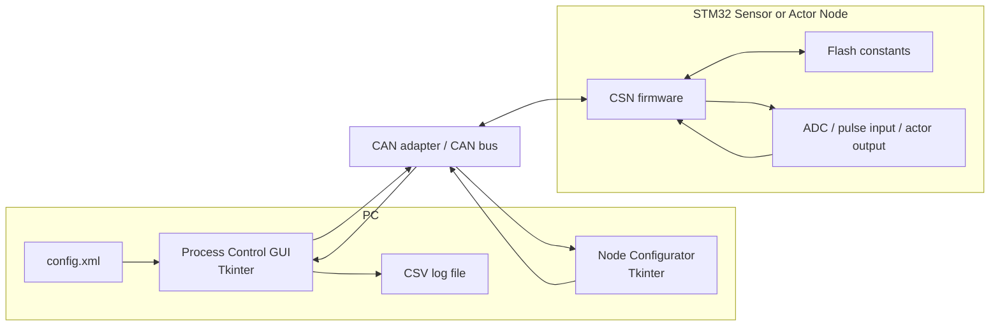
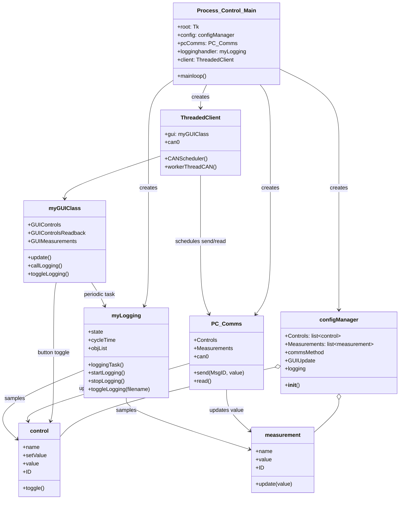
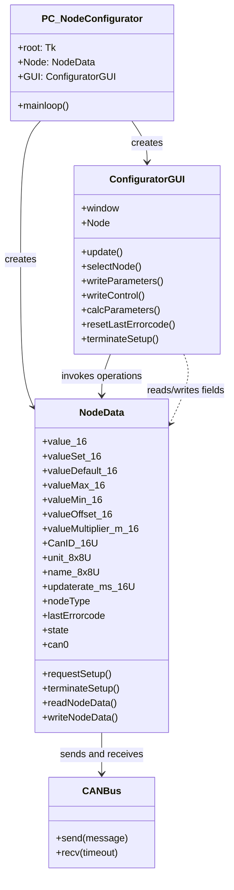
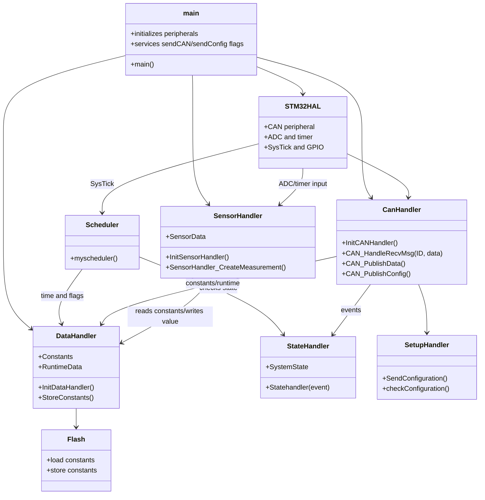
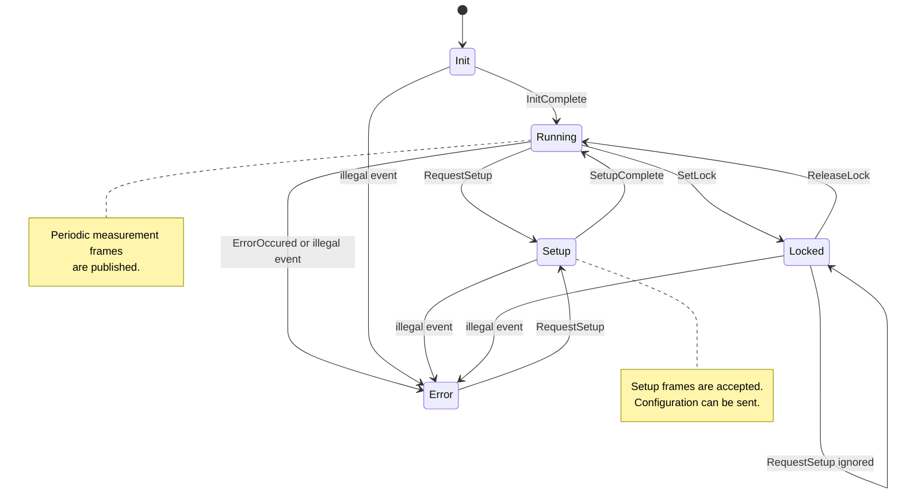
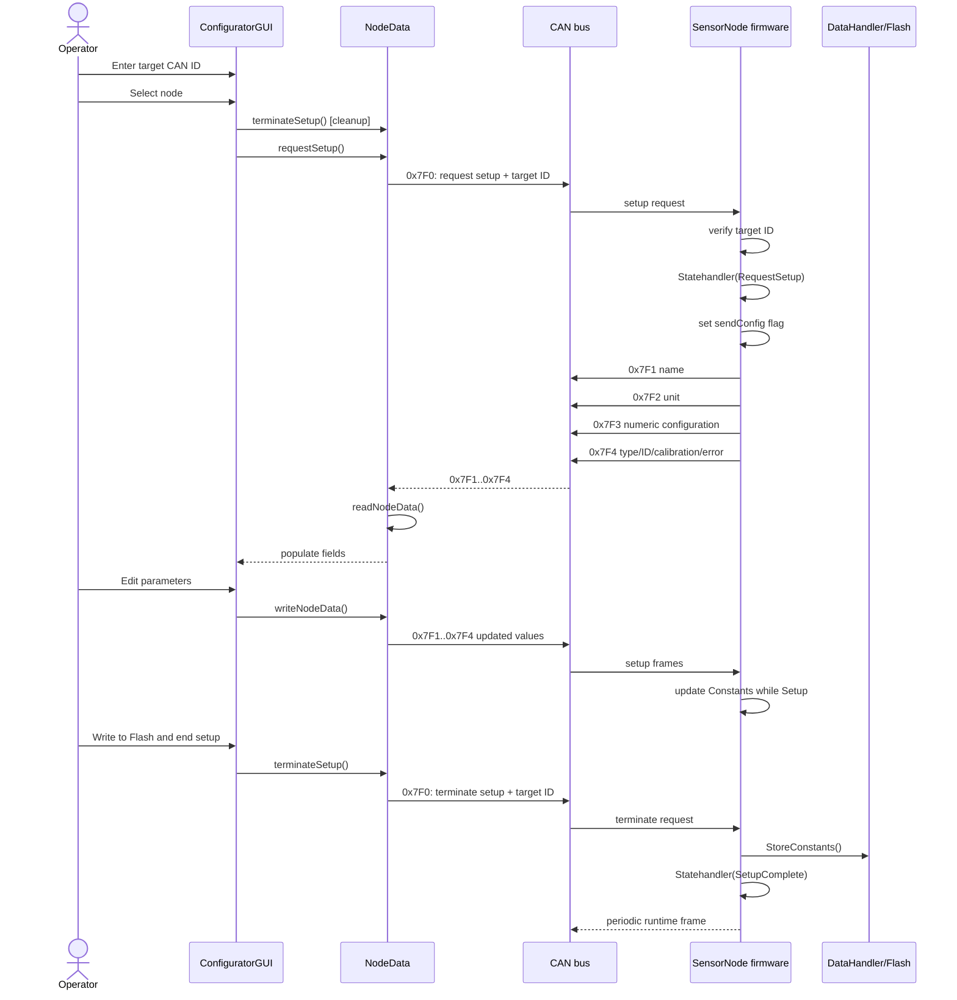
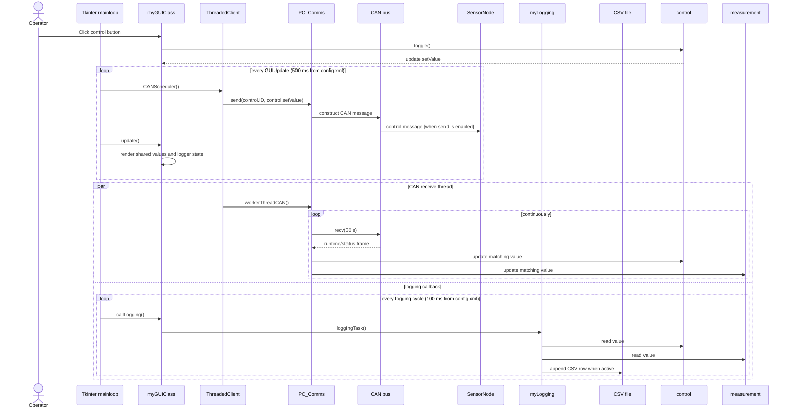

# Process Control Baseline Architecture

## 1. Scope and Status

This document describes the existing implementation in `GUI/`, `NodeConfigurator/`, and `SensorNode/Firmware/`. It is a reverse-engineered baseline, not a proposed target architecture.

The system consists of:

- A Python/Tkinter process-control GUI.
- A separate Python/Tkinter node configurator.
- An STM32 firmware image for a configurable sensor/actor node (CSN).
- A CAN bus used as the integration boundary.

The Python applications run on a PC and use `python-can`. The sensor node runs bare-metal STM32 HAL code. The CAN protocol is implemented independently in the Python applications and in `Firmware/Src/CanHandler.c`.

## 2. Software Description

### 2.1 Process-control GUI

The entry point is `GUI/Process_Control_Main.py`. Startup creates a `configManager`, a `PC_Comms` instance, a `myLogging` instance, and a `ThreadedClient`, then enters Tkinter's `mainloop()`.

`config.xml` is the GUI's runtime configuration. `configManager` parses controls, measurements, CAN message IDs, units, limits, the GUI update period, and the logging period. Each control is represented by `control.control`; each measurement is represented by `measurement.measurement`.

`myGUIClass` builds the Tkinter controls and labels. Button presses call `control.toggle()`. A Tkinter `after()` callback refreshes displayed values every `GUIUpdate` milliseconds. A second callback invokes the logger periodically.

`PC_Comms` owns the CAN interface and provides `send()` and `read()`. The background `workerThreadCAN()` repeatedly calls `read()`, which matches received arbitration IDs to configured controls and measurements and updates their shared `value` attributes.

`myLogging` writes the current values of all configured controls and measurements to a CSV file. Logging is driven by the Tkinter event loop and reads the same objects updated by the CAN reader thread.

### 2.2 Node configurator

The entry point is `NodeConfigurator/PC_NodeConfigurator.py`. `NodeData` opens the CAN interface and stores the complete node configuration and runtime values. `ConfiguratorGUI` presents these fields and invokes operations on `NodeData`.

The normal workflow is:

1. Enter a node CAN ID and press `Connect to Node`.
2. Send a setup request on `0x7F0`.
3. Receive configuration frames `0x7F1` through `0x7F4`.
4. Edit values, optionally calculate calibration parameters, and send the four configuration frames.
5. Send setup termination on `0x7F0`; the firmware stores constants in flash and returns to `Running`.

The GUI also schedules a 500 ms callback that reads runtime frames for the selected node and displays the measured value.

### 2.3 Sensor/actor node firmware

The firmware entry point is `SensorNode/Firmware/Src/main.c`. Startup initializes HAL, GPIO, DMA, ADC, CAN, timer, persistent data, CAN handling, pulse input, and sensor handling. It then sends `InitComplete` to the state handler.

`DataHandler` owns persistent `Constants` and volatile `RuntimeData`. Constants are loaded from and stored to STM32 flash page 31. Runtime data contains measured value, set value, time information, and scheduler flags.

`CanHandler` receives setup, emergency, and runtime set-value messages. It sends runtime data using the configured node CAN ID and sends configuration using four fixed setup IDs. `Scheduler` raises a publish flag after the configured update interval. The main loop then creates a measurement and publishes it.

`SensorHandler` selects a sensor or actor behavior from `Constants.nodeType` and applies linear calibration:

$$
value = rawValue * valueMultiplier_m / 1000 + valueOffset
$$

The state handler defines `Init`, `Setup`, `Running`, `Locked`, and `Error` states.

## 3. Deployment and Integration View

Both Python applications open CAN independently. The GUI's `config.xml` currently says `simulated_node`, but the main program explicitly constructs `PC_Comms` with `type="CAN"`.

## 4. GUI Class Diagram

This diagram represents Python classes and module-level runtime objects. The CAN reader thread updates the same control and measurement objects later rendered by Tkinter and sampled by the logger.

## 5. Configurator Class Diagram

`NodeData` is both the protocol client and the configurator's node model. `ConfiguratorGUI` owns the Tkinter widgets and calls the model synchronously for setup operations.

## 6. SensorNode Class/Module Diagram

The firmware is procedural C, so the diagram uses class-diagram notation to show module ownership and calls. `Constants` and `RuntimeData` are global data objects shared by the firmware modules.

## 7. SensorNode State Diagram

`RequestSetup` is accepted from `Running`, `Setup`, and `Error`; it is ignored in `Locked`. `SetupComplete` stores constants before returning to `Running`. The state handler records `Illegal_State_Change_request` for unknown events.

## 8. CAN Protocol Baseline

| CAN ID | Direction | Payload | Meaning |
| --- | --- | --- | --- |
| `0x000` | PC/node network -> node | command-specific | Emergency; node restores default set value. |
| `0x7F0` | Configurator -> node | command byte + target ID | `0x01` requests setup; `0x02` terminates setup. |
| `0x7F1` | Both during setup | 8 bytes | Node name. |
| `0x7F2` | Both during setup | 8 bytes | Engineering unit. |
| `0x7F3` | Both during setup | min, max, default, update rate | Four big-endian numeric fields. Firmware transmit includes all four. |
| `0x7F4` | Both during setup | type, CAN ID, offset, multiplier, error | Node type and calibration/configuration fields. |
| configured node ID | Node -> network | value, set value, default, state, error | Eight-byte runtime status frame. |
| configured node ID | Controller -> node | set value at protocol-defined bytes | Runtime control/set-value input; firmware reads bytes 2 and 3. |

All numeric fields in the firmware protocol are transmitted most-significant byte first. The node publishes runtime data at its configured CAN ID.

## 9. Configuration Cycle Sequence

The sequence below describes the intended implemented cycle, including the firmware's flash persistence step.

## 10. GUI Communication and Logging Sequence

The GUI intentionally shares the model objects across the Tkinter thread and CAN reader thread. There is no explicit synchronization around those attributes.

## 11. Baseline Risks and Implementation Gaps

These observations are part of the existing baseline and should be resolved before treating the architecture as a verified end-to-end implementation:

- `GUI/PC_Comms.py` constructs a CAN message but the actual `self.can0.send(msg)` call is commented out. The payload is also empty, while firmware runtime set-value handling reads bytes 2 and 3.
- `ThreadedClient` creates an additional CAN bus object, but `PC_Comms` owns the bus used by `read()` and `send()`.
- `PC_Comms.read()` assumes a non-null received frame and a two-byte payload.
- `NodeData.readNodeData()` does not unpack firmware setup message `0x7F3` according to the firmware layout: firmware sends `valueMin`, `valueMax`, `valueDefault`, and update rate, while Python assigns the first field to `value_16` and does not populate `valueMin_16`.
- `NodeData.readNodeData()` assigns the error field to `lastErrorcodelastErrorcode`, not the declared `lastErrorcode` attribute. `writeNodeData()` uses the same misspelled attribute.
- `ConfiguratorGUI.writeControl()` is unimplemented.
- The configurator performs blocking CAN receives from Tkinter callbacks, so a missing node can block the GUI during setup or update.
- Firmware has both CAN interrupt callbacks and a main-loop FIFO polling path. This creates two receive paths for the same FIFO and should be consolidated.
- `SensorHandler` contains incomplete implementations for pulse-width and actor node types. Several ADC and sensor calculations are still marked as TODO.
- The firmware `Constants.CanID` is treated as a 16-bit protocol field in the handlers, but its declared storage type should be checked for sufficient width.
- The configuration and runtime protocol has no explicit version, checksum, acknowledgement, or transaction identifier. The configurator relies on message ordering and assertions/timeouts.

## 12. Source Anchors

- GUI entry point and orchestration: [GUI/Process_Control_Main.py](../../GUI/Process_Control_Main.py)
- GUI CAN adapter: [GUI/PC_Comms.py](../../GUI/PC_Comms.py)
- GUI logging: [GUI/myLogging.py](../../GUI/myLogging.py)
- GUI configuration: [GUI/config.xml](../../GUI/config.xml)
- Configurator entry point and protocol client: [NodeConfigurator/PC_NodeConfigurator.py](../../NodeConfigurator/PC_NodeConfigurator.py)
- Firmware entry point: [SensorNode/Firmware/Src/main.c](../../SensorNode/Firmware/Src/main.c)
- Firmware CAN protocol: [SensorNode/Firmware/Src/CanHandler.c](../../SensorNode/Firmware/Src/CanHandler.c)
- Firmware state machine: [SensorNode/Firmware/Src/StateHandler.c](../../SensorNode/Firmware/Src/StateHandler.c)
- Firmware data persistence: [SensorNode/Firmware/Src/DataHandler.c](../../SensorNode/Firmware/Src/DataHandler.c)
- Firmware scheduling and measurement: [SensorNode/Firmware/Src/Scheduler.c](../../SensorNode/Firmware/Src/Scheduler.c) and [SensorNode/Firmware/Src/SensorHandler.c](../../SensorNode/Firmware/Src/SensorHandler.c)
