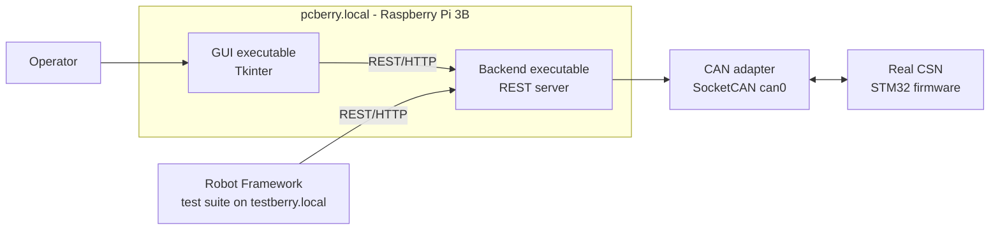
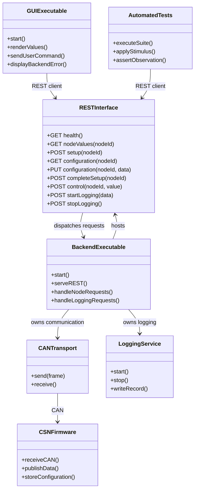
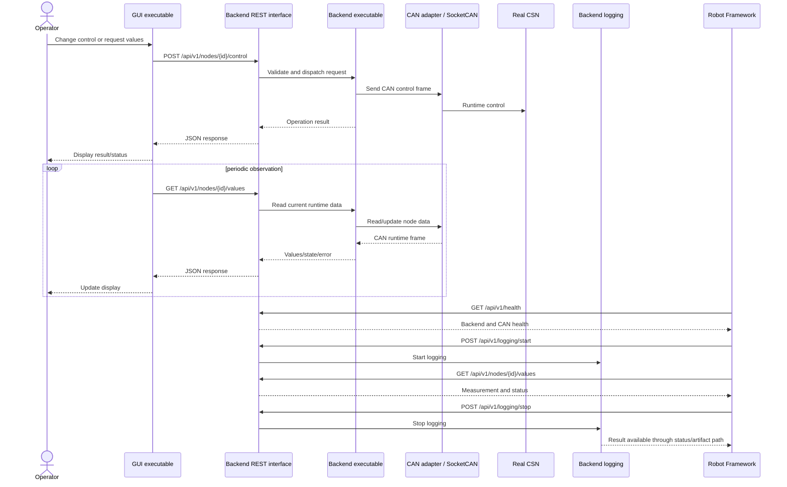
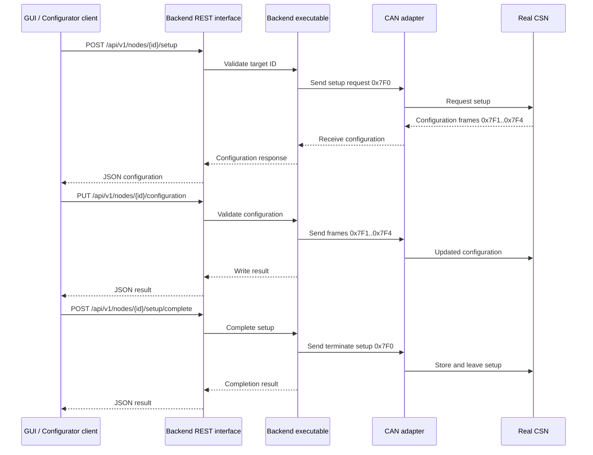

# Process Control Version 2 Architecture

## 1. Scope and Status

This document describes the planned Version 2 architecture for the Process Control software. It extends the existing implementation described in `Architecture/Baseline/Architecture.md`.

Version 2 separates the current monolithic Python process into independent executables:

- **GUI executable:** Owns the graphical user interface and presentation logic.
- **Backend executable:** Owns data handling and logging and exposes a REST interface.
- **Automated tests:** Use the Backend REST interface and do not depend on GUI widgets or GUI internals.
- **SensorNode firmware:** Remains a separate STM32 application communicating over CAN.

The internal structure of the Backend is deliberately not defined in this version of the architecture. Its public REST contract and deployment boundary are defined; its internal modules, classes, persistence strategy, and concurrency model will be specified later.

## 2. Architectural Change

### 2.1 Existing architecture

In the baseline implementation, GUI presentation, CAN communication/data handling, and logging are implemented as one Python application. The GUI event loop, CAN reader thread, shared data objects, and logger are coupled through module-level objects.

```text
Current monolithic process

Process_Control_Main.py
  - Tkinter GUI
  - configuration handling
  - CAN communication
  - runtime data handling
  - CSV logging
```

This arrangement makes automated testing dependent on the GUI process and makes it difficult to operate data handling or logging independently of a graphical session.

### 2.2 Version 2 architecture

Version 2 introduces a process boundary:

```text
GUI executable  <---- REST/HTTP ---->  Backend executable  <---- CAN ---->  CSN
     |                                      |
     |                                      +---- data handling
     |                                      +---- logging
     |
     +---- user interaction and presentation

Robot Framework tests  <---- REST/HTTP ---->  Backend executable
```

The GUI and automated tests are clients of the Backend. The Backend is the owner of runtime data, node communication, and logging operations. The GUI must not access Backend internals directly.

## 3. Software Description

### 3.1 GUI executable

The GUI runs as its own process and owns the Tkinter window, controls, measurement display, user actions, and presentation state.

Responsibilities:

- Create and manage the graphical interface.
- Collect user commands and input values.
- Display values, node state, errors, and logging status obtained from the Backend.
- Request control, configuration, and logging operations through REST.
- Handle Backend availability and REST errors visibly.
- Avoid direct CAN access and direct access to Backend data structures.

The GUI may use a local configuration file for presentation settings, but operational node data and logging state are obtained from the Backend API.

### 3.2 Backend executable

The Backend runs as an independent process or service. It provides the REST interface used by the GUI and automated tests.

Responsibilities:

- Own the runtime data model.
- Handle CAN communication with the CSN and other nodes.
- Provide node configuration and control operations.
- Own logging and log-file lifecycle.
- Expose current values, state, errors, and operation results through REST.
- Serialize or coordinate conflicting operations from multiple clients.
- Validate requests before sending CAN frames.
- Return explicit success, failure, timeout, and communication-error responses.

The Backend's internal structure is **to be defined later**. The following are intentionally not prescribed by this document:

- Internal package/module decomposition.
- Choice of web framework.
- CAN worker/thread/asyncio design.
- In-memory versus persistent data storage.
- Logging implementation details.
- Internal class names and interfaces.

### 3.3 REST interface

The REST interface is the public integration boundary between the Backend and its clients.

The initial resource groups should include:

| Resource | Example endpoint | Purpose |
| --- | --- | --- |
| Health | `GET /api/v1/health` | Report Backend, CAN, and dependency status. |
| Runtime values | `GET /api/v1/nodes/{id}/values` | Read measured value, set value, state, and error. |
| Setup | `POST /api/v1/nodes/{id}/setup` | Request node setup mode. |
| Configuration | `GET /api/v1/nodes/{id}/configuration` | Read node configuration. |
| Configuration | `PUT /api/v1/nodes/{id}/configuration` | Validate and write node configuration. |
| Setup | `POST /api/v1/nodes/{id}/setup/complete` | Store configuration and leave setup mode. |
| Control | `POST /api/v1/nodes/{id}/control` | Send a runtime set/control value. |
| Logging | `POST /api/v1/logging/start` | Start logging. |
| Logging | `POST /api/v1/logging/stop` | Stop logging. |
| Logging | `GET /api/v1/logging/status` | Read logging state and active file information. |

The exact request and response schemas are a subsequent design task. The API should use JSON, explicit status/error information, timeouts, and versioning under `/api/v1`.

## 4. Component and Deployment View



### Deployment responsibilities

| Deployment node | Process/component | Responsibility |
| --- | --- | --- |
| `pcberry.local` | GUI executable | User interface and presentation. Communicates with Backend through REST. |
| `pcberry.local` | Backend executable | Data handling, CAN communication, logging, REST API, request validation, and operation coordination. |
| `testberry.local` | Robot Framework | Automated test execution. Uses Backend REST API and controls the Arduino Nano stimulus system. |
| `pcberry.local` | CAN adapter / SocketCAN | Provides the Backend's physical CAN connection to the CSN. |
| CSN hardware | STM32 firmware | Device under test; receives CAN commands and publishes measurements/status. |

The Arduino Nano HIL stimulator remains controlled by `testberry.local` as documented in the infrastructure architecture. Automated tests use the Backend REST API for observations and CSN operations, and use the testberry-side stimulus interface for resistance, voltage, and pulse inputs.

## 5. Process and Interface Diagram



`LoggingService` and `CANTransport` are conceptual ownership boundaries only. Their internal implementation is intentionally deferred with the rest of the Backend structure.

## 6. REST Interaction Sequence



## 7. Configuration Sequence

The Configurator GUI may either become a separate GUI client or be hosted as another presentation component. In both cases, configuration operations must pass through the Backend REST interface.



## 8. Interface Rules

- The GUI communicates with the Backend only through REST.
- Robot Framework communicates with the Backend only through REST for CSN data, configuration, control, and logging.
- The Backend is the only application component that owns the CAN connection on `pcberry.local`.
- GUI and automated tests must not access Backend memory, files, or internal Python modules directly.
- REST calls must include timeouts and distinguish validation, communication, timeout, and server errors.
- The Backend must serialize operations that could conflict, such as simultaneous setup sessions, configuration writes, logging transitions, or control commands.
- GUI and test clients must tolerate the Backend being unavailable and must expose actionable error information.
- API versioning must be used from the first implementation.
- The Backend API must not expose CAN frame construction as its primary public abstraction; clients should use semantic operations such as `control`, `configuration`, and `values`.

## 9. Migration Strategy

1. Define and test the REST schemas for health, values, control, configuration, and logging.
2. Extract CAN communication and shared runtime data ownership from the GUI process into the Backend executable.
3. Move logging into the Backend while preserving the existing CSV output requirements.
4. Replace GUI direct data and CAN access with REST client calls.
5. Add Robot Framework REST keywords using the same public API as the GUI.
6. Run GUI and automated tests against one Backend instance on `pcberry.local`.
7. Define the Backend internal architecture after the external contract and operational behavior are stable.
8. Add service startup, health checks, log locations, and restart behavior for the two executables.

## 10. Open Design Decisions

The following decisions are intentionally left open for the next architecture iteration:

- REST framework and server implementation.
- Backend internal module and class structure.
- Synchronous versus asynchronous REST request handling.
- CAN receive scheduling and buffering strategy.
- Runtime data persistence and retention.
- Log file format, rotation, and storage location.
- Authentication and authorization requirements on the test network.
- Whether the GUI and Configurator are separate executables or two views in one GUI executable.
- Exact Robot Framework library and test-result artifact format.

## 11. Summary

Version 2 replaces the monolithic GUI/data/logging process with two independently deployable executables. The GUI focuses on presentation. The Backend owns data handling and logging and exposes a versioned REST interface. Both the GUI and Robot Framework use that interface, while only the Backend communicates with the CSN over CAN. The Backend's internal design remains deliberately deferred.
